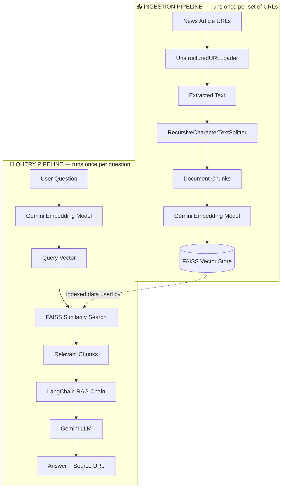
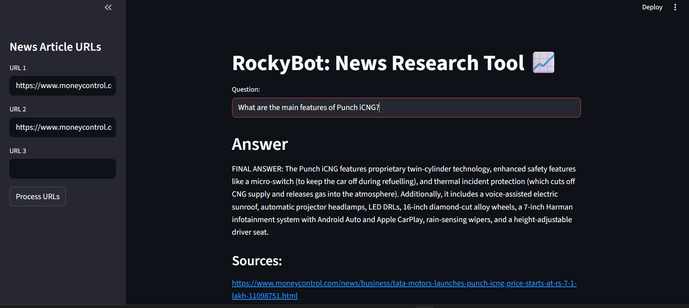
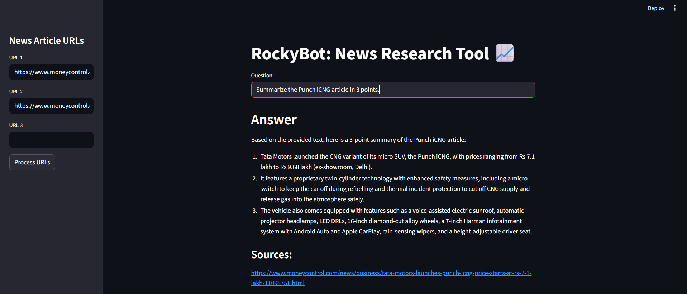

# RockyBot – News Research Assistant (RAG)

A Retrieval-Augmented Generation (RAG) application that turns a set of news article URLs into a searchable knowledge base — so a user can ask direct questions and get source-grounded answers instead of manually reading full articles.

*Portfolio-level implementation of an industry-standard RAG architecture, built with Python, LangChain, Google Gemini, and FAISS.*

📄 **[Read the full Project Report (PDF)](Project_Report.pdf)** — detailed architecture, RAG concepts, implementation challenges, and validation.

---

## 1. Project Snapshot — 6 Questions

| Business Question | RockyBot Answer |
|---|---|
| **Problem** | Manual research across multiple news articles is time-consuming |
| **Tools & Methods** | Python, Streamlit, LangChain, Gemini LLM, Gemini Embeddings, FAISS, RAG |
| **Insights** | Fast extraction of prices, features, facts, and summaries from supplied articles |
| **Action Enabled** | Faster research and information gathering |
| **KPI** | Research / information retrieval time |
| **Impact** | Expected reduction in manual research effort; not formally measured |

---

## 2. Overview
RockyBot lets a user paste in up to three news article URLs and ask plain-English questions against them. It loads and chunks the article text, embeds the chunks with Gemini, indexes them in FAISS, and — for every question — retrieves only the relevant chunks before asking Gemini to generate an answer, returned together with its source URL.

**Problem → Solution → Value → Technology, at a glance:**

```
Manual article research is slow
        ↓
RockyBot indexes articles into a searchable knowledge base
        ↓
User gets fast, source-grounded answers instead of reading full articles
        ↓
Built with LangChain + Gemini + FAISS (RAG architecture)
```

## 3. Business Problem
Finding one specific fact — a price, a feature, a safety spec — inside a long news article means reading through the whole thing. That gets worse as the number of articles grows, or when the answer is scattered across more than one source.

**Business Question:**
> How can a user retrieve relevant information from multiple news articles quickly, without manually reading the entire articles?

This is an information-retrieval and research-efficiency problem before it is a technology problem — RAG is simply the mechanism used to solve it.

## 4. Business Value

### Problem
Manual article research is time-consuming.

### Solution
RockyBot converts article URLs into a searchable semantic knowledge base and provides source-grounded answers.

### Insight
Users can quickly retrieve facts, features, prices, and summaries from article content.

### Action Enabled
Users can perform faster research and use retrieved information as input to later decisions.

### KPI
Primary potential KPI: **Research / Information Retrieval Time**.

### Impact
**Expected impact:** reduced manual information-search effort.
**Measured impact:** not formally quantified in this portfolio implementation.

## 5. Technical Solution
In business-friendly terms, the pipeline is:

```
News URLs → Article extraction → Text chunking → Gemini embeddings
→ FAISS semantic search → Relevant context → Gemini LLM → Answer + source
```

Each piece exists to remove one manual step from the research process:

| Step | What it replaces manually |
|---|---|
| Article extraction | Opening and reading each article page |
| Text chunking | Scanning a long article for the relevant paragraph |
| Semantic search (FAISS) | Skimming multiple articles to find the one with the answer |
| Answer generation (Gemini) | Re-reading and synthesizing the passage into a direct answer |

## 6. Tools & Technologies
| Layer | Technology | Role |
|---|---|---|
| Language | Python | Application logic |
| UI | Streamlit | User interface |
| Document Loading | `UnstructuredURLLoader` | Article extraction |
| Text Splitting | `RecursiveCharacterTextSplitter` | Chunking |
| Embedding Model | Gemini Embeddings (`models/gemini-embedding-2`) | Converts text into vectors (semantic representation) |
| Vector Store | FAISS | Retrieves relevant vectors/chunks |
| Orchestration | LangChain (`RetrievalQAWithSourcesChain`) | Connects retrieval and generation |
| LLM | Google Gemini (`gemini-3.5-flash-lite`) | Generates the final answer |

*Adapted from an OpenAI-based tutorial — the LLM and embedding layer here run on Google Gemini instead.*

## 7. Architecture

The system runs in two stages: an **ingestion pipeline** that indexes the supplied articles (run once per set of URLs), and a **query pipeline** that answers questions against that index (run once per question).



**Component responsibilities:**
| Component | Role |
|---|---|
| FAISS | Retrieval / similarity search only |
| Gemini LLM | Reasoning and answer generation only |
| LangChain | Orchestration layer connecting retriever, context, and LLM |
| Streamlit | User interface only |

## 8. How RAG Works
- **Gemini Embeddings** convert article text and user questions into numerical vectors that capture meaning, not just keywords.
- **FAISS** enables the application to quickly retrieve the article passages most relevant to the user's question — reducing the need for manual article scanning.
- **Gemini LLM** reads only those retrieved passages and generates a direct, grounded answer, rather than relying on general training knowledge.
- **LangChain** connects these pieces so a single question produces one answer plus its source, in one call.

## 9. What Was Implemented
- Document ingestion: URL → `UnstructuredURLLoader` → text → `RecursiveCharacterTextSplitter` (`chunk_size=1000`, `chunk_overlap=200`) → Gemini embeddings → FAISS index
- Local FAISS persistence (`save_local()` / `load_local()`), so an existing index can be reloaded without rebuilding it as long as the indexed documents haven't changed
- Query pipeline: question → Gemini embedding → FAISS similarity search → relevant chunks → `RetrievalQAWithSourcesChain` → Gemini LLM → answer + source URL
- Streamlit UI: sidebar with 3 URL inputs and a "Process URLs" button, main area with a question box, answer, and sources

## 10. Information Insights / Example Execution
RockyBot doesn't generate business insights on its own data — it enables **information insights**: specific facts pulled from the supplied articles, on demand, with a source attached.

**Tested example — direct feature question:**



> **Business Question:** "What are the main features of Punch iCNG?"
> **Answer:** Twin-cylinder technology with a micro-switch and thermal incident protection, a voice-assisted electric sunroof, automatic projector headlamps, LED DRLs, 16-inch alloy wheels, a 7-inch Harman infotainment system with Android Auto/Apple CarPlay, rain-sensing wipers, and a height-adjustable driver's seat.

**Tested example — summarization:**



> **Business Question:** "Summarize the Punch iCNG article in 3 points."
> **Answer:**
> 1. Tata Motors launched the Punch iCNG, priced from ₹7.1 lakh to ₹9.68 lakh (ex-showroom, Delhi)
> 2. It uses twin-cylinder technology with safety measures including a refuelling micro-switch and thermal incident protection
> 3. It includes an electric sunroof, projector headlamps, LED DRLs, alloy wheels, infotainment, rain-sensing wipers, and a height-adjustable driver's seat

Both answers were returned with the originating Moneycontrol URL — these are examples of information insights extracted from supplied source content, not independently derived business insights.

## 11. Action Enabled
RockyBot supports the decision-making process; **it does not make business decisions autonomously.** It enables a user to:
- Decide which article contains the relevant information
- Quickly identify a product's price or features
- Compare information across the supplied articles
- Get a concise summary before deeper reading
- Use retrieved facts as input to a later research or business decision

## 12. KPI and Business Impact
**Potential KPI affected:** Research time / information retrieval time.

If deployed in a research workflow, the system could reduce the amount of manual article reading required to locate specific information.

| | |
|---|---|
| **Expected impact** | Faster information discovery, reduced manual article scanning, easier access to specific facts, source-grounded research |
| **Measured impact** | Not formally quantified in the current portfolio implementation |

**Potential future measurement:** average research time before vs. after using RockyBot, average time to locate a requested fact, retrieval relevance, answer groundedness, user task-completion time.

## 13. Validation
Tested with a range of question types against an indexed article, including:
- "What is the price of the Punch iCNG?"
- "What are the main features of Punch iCNG?"
- "What safety features does Punch iCNG have?"
- "Summarize the Punch iCNG article in 3 points."

In each case, the answer was generated from the indexed article content, with the corresponding source URL displayed alongside it. No formal accuracy metrics were measured; validation was functional — confirming answers were grounded in the correct source article.

## 14. How to Run
```bash
git clone https://github.com/Sahajahanur/news-research-assistant-rag.git
cd news-research-assistant-rag
pip install -r requirements.txt
```
Add your Gemini API key as an environment variable or local config (not committed — see `.gitignore`), then:
```bash
streamlit run main.py
```
Enter up to 3 news article URLs in the sidebar, click **Process URLs**, then ask a question in the main input box.

## 15. Project Structure
```
news-research-assistant-rag/
│
├── main.py                     # Streamlit app + RAG pipeline logic
├── requirements.txt             # Project dependencies
├── notebook/                    # Experimentation / development notebook(s)
├── research_tool.png            # Screenshot — direct question example
├── research_tool_summary.png    # Screenshot — summarization example
├── Project_Report.pdf           # Full project report
├── .gitignore
└── README.md
```

## 16. Limitations
- Local FAISS store only (no cloud vector database)
- No authentication or multi-user support
- No production monitoring/logging
- URL-based ingestion only (no file upload)
- No hybrid search or reranking layer
- No formal measurement of research-time impact yet

## 17. Future Work
- PDF / document upload
- Hybrid keyword + vector search and reranking
- Conversation memory
- Retrieval relevance / groundedness evaluation
- Cloud vector database, authentication, logging, and Docker/cloud deployment
- Formal measurement of research-time impact (before/after task timing)

## 18. Results & Conclusion
RockyBot demonstrates a complete, working RAG pipeline — ingestion, chunking, embedding, retrieval, and grounded generation — validated across direct-fact, feature, and summarization questions, with every answer traceable to its source article. It is a portfolio-level implementation of an industry-standard RAG architecture, not a production-scale deployment.

## 19. Author & Contact
**Sahajahanur Rahman Laskar**
Email: connectingsrl@gmail.com
LinkedIn: [linkedin.com/in/sahajahanur-laskar](https://www.linkedin.com/in/sahajahanur-laskar/)
GitHub: [github.com/Sahajahanur](https://github.com/Sahajahanur)
